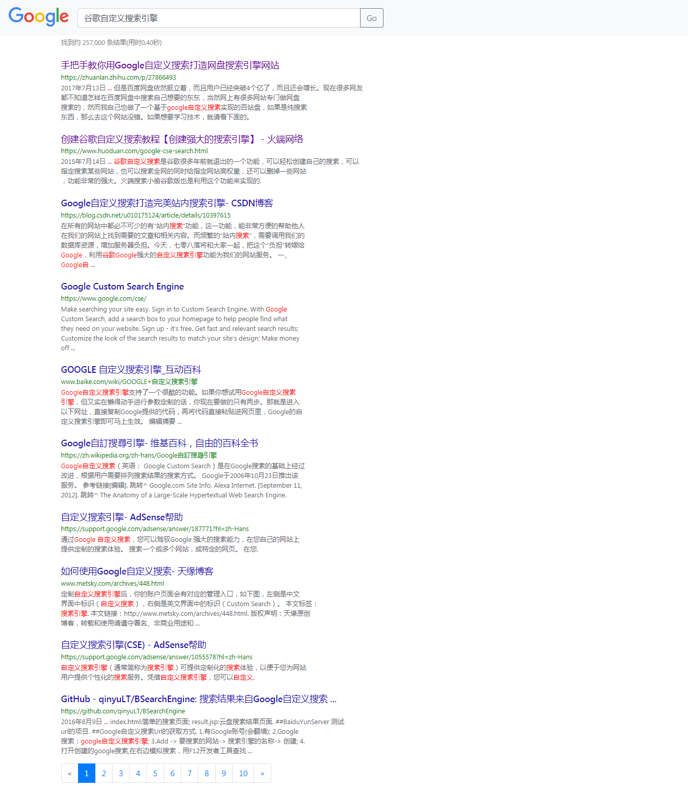

# Google Custom Search

## Introduction
+ Just for learning
+ Use Google Custom Search API to find learning materials that you are looking for
+ It is a Node.js implementation search page
+ Use [jsencrypt](https://github.com/travist/jsencrypt) to encrypt search words
+ Use XOR encryption to encrypt results

## How to use
### required
+ Git
+ Node.js 6 or above
+ [A Google Custom Search API KEY](https://console.developers.google.com)
+ [A Google Custom Search Engine ID](https://cse.google.com/cse/all)
+ A pair of rsa`s key

### configuration
+ config cx/key/private_key in config.json or config environment variables, such as KEY/CX/PRIVATE_KEY
+ change your public_key in public/javascripts/index.js

### run
PS: Your vps or platform must be able to visit Google
```
npm start
```

## Pictures



## License
Dual-licensed under [BSD 2-Clause License](http://opensource.org/licenses/BSD-2-Clause) and [GPLv2 with the Classpath Exception](http://openjdk.java.net/legal/gplv2+ce.html).